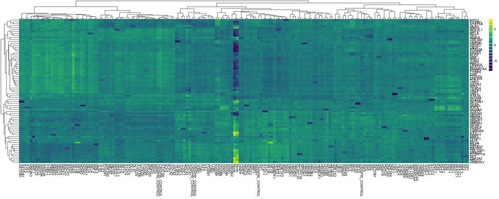
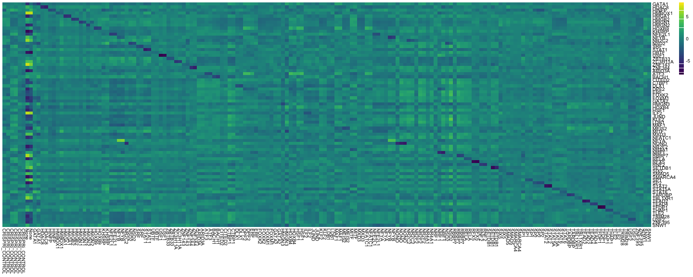

<style>
.small-code pre code {
  font-size: 1em;
}

.smaller-code pre code {
  font-size: 14px;
}

</style>

Lecture 1 Course Overview & GENAVi
========================================================
author: Dennis Hazelett
date: 3/23/2021
autosize: true
transition: fade


Introduction
========================================================

Course Goals

- Learn a common bioinformatics pipeline (RNA-seq expression profiling)
- Know how to conduct and interpret common analyses associated with this kind of data
- Gain an understanding of next-generation sequencing (NGS) technology

Course Structure
========================================================

We will spend 6 weeks exploring a single big dataset

- Real world analyses take months to complete
- Want to maximize familiarity with the data so we can focus on elements of the pipeline
- The more you look, the more you see
- Minimize time wasted on munging new datasets
- Go beyond superficial understanding of NGS data

The DATA
========================================================
class: small-code

ENCODE PROJECT (Michael Snyder's lab)

- 168 CRISPRi experiments (including controls)
- CRISPRi knockdown of individual *T*ranscription *F*actors (TFs)
- 74 individual TFs, 2 replicates each, 7 batches


```
                ENCSR000CPH_1 ENCSR000CPH_2 ENCSR011GAO_1 ENCSR011GAO_2
ENSG00000223972             2            10            14            11
ENSG00000227232           689          1018           839          1043
ENSG00000278267           329           605           115           179
ENSG00000243485            10            14             6             8
ENSG00000284332             0             0             0             0
ENSG00000237613             0             1             3             0
ENSG00000268020             4             0             0             0
ENSG00000240361            12             8             5             6
ENSG00000186092             4             0             0             0
ENSG00000238009           684          1002           147           270
ENSG00000239945           316           509            86           137
ENSG00000233750            28            22           109            67
ENSG00000268903           131           247           270           595
ENSG00000269981           213           316           118           292
ENSG00000239906             4            14             9             5
```

The DATA
========================================================
class: small-code

ENCODE PROJECT (Michael Snyder's lab)

- 168 CRISPRi experiments (including controls)
- CRISPRi knockdown of individual *T*ranscription *F*actors (TFs)
- 74 individual TFs, 2 replicates each, 7 batches


```
                    treatment batch  crispri_geneid
ENCSR016WFQ_1 CRISPRi_CONTROL     A            <NA>
ENCSR016WFQ_2 CRISPRi_CONTROL     A            <NA>
ENCSR095PIC_1 CRISPRi_CONTROL     B            <NA>
ENCSR095PIC_2 CRISPRi_CONTROL     B            <NA>
ENCSR761AQZ_1 CRISPRi_CONTROL     C            <NA>
ENCSR761AQZ_2 CRISPRi_CONTROL     C            <NA>
ENCSR000CPH_1            None     Z            <NA>
ENCSR000CPH_2            None     Z            <NA>
ENCSR850LOZ_1           GATA1     A ENSG00000102145
ENCSR850LOZ_2           GATA1     A ENSG00000102145
ENCSR369BHC_1           HDAC8     A ENSG00000147099
ENCSR369BHC_2           HDAC8     A ENSG00000147099
ENCSR713AEC_1           HINFP     A ENSG00000172273
ENCSR713AEC_2           HINFP     A ENSG00000172273
ENCSR942XXL_1          HMBOX1     A ENSG00000147421
```

The Method
========================================================

Why GENAVi?
- emphasize practical skills
- de-emphasize programming skills

"What if I am already a cloud-computing ML jockey?"
- There is some value to learning GENAVi, _e.g._ teach DEA to non-computer savvy colleagues
- Engage with course instructers on more interesting problems

Attendance & Homework Expectations
========================================================
* To receive credit for this course **_you must attend every lecture_**
  * exeptions: absences excused by graduate school and untimely death
  
* Homework is due on the date listed on the syllabus, but can be turned in no more than **_1 lecture later_** for a maximum of 50% credit.

Syllabus Topics
========================================================
* Today (3/23) **Installing GENAVi**
* 3/25 **Differential Gene Expression (DGE)**
* 4/1  **Exporatory Analysis**
* 4/6 **Gene Ontology Analysis**
* 4/13 **NGS & File Formats**
* 4/15 **Gathering and interpreting quality control (QC) metrics**

Schedule
========================================================

| day | date  | lecture   | hmwk (pts) | due  |
| :-- | :---- | :-------- | :--------- | :--- |
| Tue | 03/23 | Intro     | L1 (10)    |      |
| Thu | 03/25 | DGE       | L2 (10)    | L1   |
| Tue | 03/30 | Wkshp     | -          | L2   |
| Thu | 04/01 | Expl Anls | L3 (10)    |      |
| Tue | 04/06 | GO Anls   | L4 (10)    | L3   |
| Thu | 04/08 | Wkshp     | -          | L4   |
| Tue | 04/13 | Formats   | QS5 (10)   |      |
| Thu | 04/15 | MultiQC   | QS6 (10)   | QS5  |
| Tue | 04/20 | Review    | -          | QS6  |
| Thu | 04/22 | Exam      | E1 (30)    | E1   |

Grading
========================================================

- 4 labs (10s pt each)
- 2 question sets (10 pts each)
- 1 oral presentation (10 pts)
- 1 final exam (30 pts)


```r
4 * 10 + 2 * 10 + 10 + 30
```

```
[1] 100
```

Oral Presentations
========================================================

- does not include the first assignment
- 5-10 minutes 
- "lab meeting style" show graphs, discuss conclusions, challenges
- sign up now! 4 opportunities 3/25, 3/30, 4/6, 4/8
- up to 2 people during each workshop

Course Materials
========================================================
* All course materials available via:
* GitHub: orgs/Junkdnalab/hugego
* Box: Bioinformatics2021

Includes:
- lecture slides
- homework & question sets
- all code
- reading assignments

Let's look at some data
========================================================
class: small-code


```r
unique(replicate_model$treatment)
```

```
 [1] "CRISPRi_CONTROL" "None"            "GATA1"           "HDAC8"          
 [5] "HINFP"           "HMBOX1"          "HMGA1"           "HMGB2"          
 [9] "HMGN1"           "HMGN2"           "HOXB9"           "KHSRP"          
[13] "NFE2L1"          "NFYB"            "NR2C2"           "NSD2"           
[17] "SRF"             "STAT1"           "UBTF"            "USF1"           
[21] "ZBTB33"          "ZC3H11A"         "ZNF143"          "ZNF384"         
[25] "ARID3A"          "ATF3"            "BACH1"           "CITED2"         
[29] "CTBP1"           "DLX1"            "DPF2"            "ERF"            
[33] "FOXK2"           "FOXM1"           "GATA2"           "HMGN3"          
[37] "HOXB4"           "HSF1"            "ILF2"            "JUND"           
[41] "KLF2"            "LDB1"            "MAF1"            "MEIS2"          
[45] "MITF"            "MXD3"            "NFATC1"          "NFYA"           
[49] "NONO"            "NR2F2"           "NR4A1"           "NRF1"           
[53] "RBBP7"           "RELA"            "RFX5"            "RNF2"           
[57] "SETDB1"          "SIX5"            "SMAD5"           "SMARCA4"        
[61] "SP1"             "SP2"             "STAT2"           "STAT5A"         
[65] "STAT6"           "TARDBP"          "TBL1XR1"         "TEAD2"          
[69] "TEAD4"           "TFDP1"           "THAP1"           "TLE2"           
[73] "TRIM28"          "USF2"            "ZNF395"          "SNW1"           
```

Global overview
========================================================
class: smaller-code


```
        CRISPRi_CONTROL CRISPRi_CONTROL CRISPRi_CONTROL CRISPRi_CONTROL
TARDBP        13.432528       13.429543       12.617259       12.631160
HMGN2         14.717613       14.924951       14.010037       14.042557
SETDB1        11.682990       11.583562       11.850940       11.807311
RFX5          11.078219       10.702032       11.261874       11.424052
ILF2          13.416964       13.323124       13.094658       13.049305
USF1          11.108775       11.346560       11.414050       11.452775
RNF2          10.797422       10.636422       10.376887       10.213850
ZC3H11A       13.493157       13.283328       12.949208       12.909413
ATF3           9.227112        9.470366        9.591896        9.662808
DLX1           9.829317        9.828784        9.495555        9.597051
        CRISPRi_CONTROL CRISPRi_CONTROL      None      None     GATA1     GATA1
TARDBP        13.021063       13.123668 13.977797 13.757525 12.940071 13.251769
HMGN2         14.371155       14.372130 12.497788 12.775956 14.243151 14.464684
SETDB1        11.663018       11.790066 12.368485 12.560074 11.858320 11.720890
RFX5          11.201797       11.094701 11.582868 11.429807 11.215334 11.175014
ILF2          13.217057       13.271193 15.194408 14.987164 13.108546 13.107200
USF1          11.375519       11.313394 11.225001 11.199522 11.484698 11.258671
RNF2          10.808789       10.774496 11.528022 11.247869 10.799880 11.398249
ZC3H11A       13.268714       13.354711 14.408988 14.445624 13.340079 13.689900
ATF3           9.318656        9.044274  9.772777  9.861096  9.892308  9.824920
DLX1           9.156243        8.874036  9.568087 10.029173  9.796645  9.795714
```


Global overview plot
========================================================
class: small-code


```r
pheatmap(plot_matrix, 
         color = viridis(100), 
         clustering_distance_cols = "correlation",
         clustering_distance_rows = "euclidean",
         scale = "row")
```



Ordered TFs
========================================================
class: small-code


```r
pheatmap(plot_matrix[order(match(rownames(plot_matrix), colnames(plot_matrix))), ], 
         color = viridis(100), 
         cluster_rows = FALSE,
         cluster_cols = FALSE,
         scale = "row")
```


