<style>
.small-code pre code {
  font-size: 1em;
}
</style>

Lecture 3 Exploratory and Principle Components Analysis
========================================================
author: Dennis Hazelett
date: 5/12/2020
autosize: true
transition: fade


statistical _vs._ probabalistic models
========================================================
Last lecture we talked about different types of analyses
* fitting data to model
* fitting model to data

statistical _vs._ probabalistic models
========================================================
Last lecture we talked about different types of analyses
* fitting data to model -- "statistical models"
* fitting model to data -- "probabalistic models"

statistical _vs._ probabalistic models
========================================================
Last lecture we talked about different types of analyses
* fitting data to model -- "statistical models"
* fitting model to data -- "probabalistic models" - "generative"

Approaching a generative model of count data for RNA-seq
========================================================

Suppose we flip a coin (Bernoulli distribution)


```r
rbinom(n=10, size = 1, prob=0.5)
```

```
 [1] 0 1 1 0 1 1 1 0 1 1
```

Genes according to the binomial distribution
========================================================

Apply bernoulli logic to count data in RNA-seq


```r
rbinom(n=1, size = 4e07, prob=1e-05) # 40m reads, 10 CPM
```

```
[1] 393
```

poisson distribution
========================================================
class: small-code

Apply bernoulli logic to count data in RNA-seq


```r
ngenes <- 2e04 # 20,000 protein coding genes
gene_expr <- rbeta(ngenes, 1, 1 + ngenes)
```

poisson distribution (cont'd)
========================================================
class: small-code

Apply bernoulli logic to count data in RNA-seq


```r
ngenes <- 5.8e04 # 58,000 coding genes
gene_expr <- rbeta(ngenes, 1, 1 + ngenes)
hist(gene_expr)
```

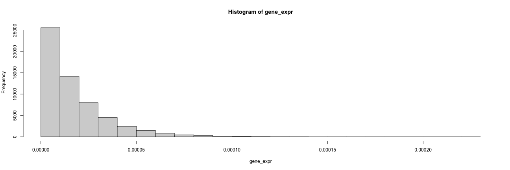

poisson distribution (cont'd)
========================================================
class: small-code 

Simulating count data using poisson

key parameter: lambda (also called the "rate" parameter; lambda = p * total_obs)


```r
read_depth <- 4e07 # 40m reads
expr_level <- rpois(n=ngenes, lambda = gene_expr * read_depth)
sim_genes_1 <- data.frame(gene_id = 1:ngenes, expr_level)
expr_vals_plot <- ggplot(sim_genes_1, aes(x=expr_level)) + geom_histogram()
```

graph of poisson simulated counts
========================================================
class: small-code 


```r
read_depth <- 4e07 # 40m reads
expr_level <- rpois(n=ngenes, lambda = gene_expr * read_depth)
sim_genes_1 <- data.frame(gene_id = 1:ngenes, expr_level)
expr_vals_plot <- ggplot(sim_genes_1, aes(x=expr_level)) + geom_histogram()
expr_vals_plot
```

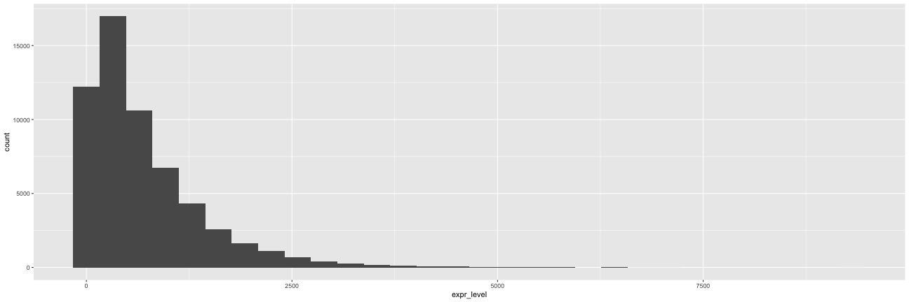

What about real data???
========================================================
class: small-code

Let's look at some of our CRISPRi data:


```r
tead2counts <- read.csv(file = "~/repos/hgg_2020/data/teadfeatcounts.csv", row.names="Geneid")
head(tead2counts)
```

```
                ENCSR074FBG_1 ENCSR074FBG_2 ENCSR095PIC_1 ENCSR095PIC_2
ENSG00000223972            11            14             8            17
ENSG00000227232           908           725          1025          1655
ENSG00000278267           119           102           112           196
ENSG00000243485             8             8            11             9
ENSG00000284332             0             0             0             0
ENSG00000237613             3             1             0             0
```


What about real data???
========================================================
class: small-code 

How are these data distributed?


```r
colSums(tead2counts)
```

```
ENCSR074FBG_1 ENCSR074FBG_2 ENCSR095PIC_1 ENCSR095PIC_2 
     45382781      46581667      35232719      57353463 
```

What about real data???
========================================================
class: small-code

How are these data distributed?


```r
ggplot(gather(tead2counts, key = 'sample', value = 'expression'), aes(y = sample, x = expression)) + geom_density_ridges()
```

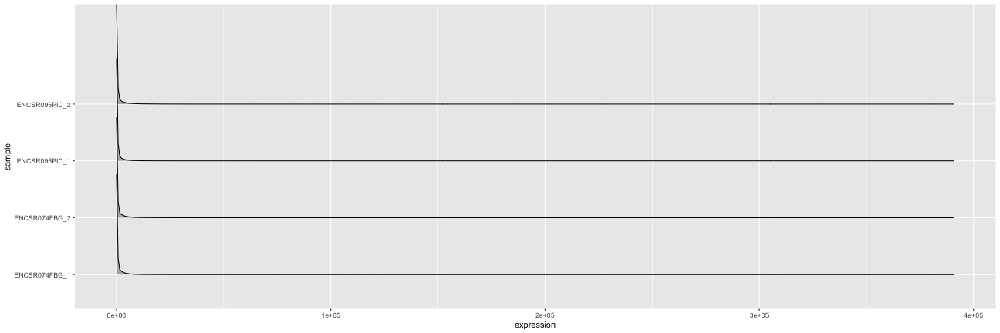

What about real data???
========================================================
class: small-code 

Log scale reveals problems


```r
ggplot(gather(tead2counts, key = 'sample', value = 'expression'), 
       aes(y = sample, x = expression + 1)) + 
  geom_density_ridges() + scale_x_log10() + theme_minimal() + 
  theme(text = element_text(size=20))
```

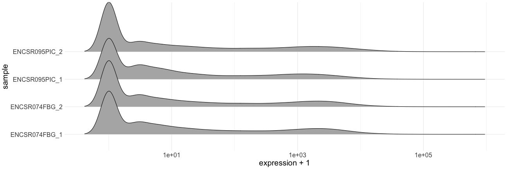

```r
sum(rowSums(tead2counts)==0)
```

```
[1] 12700
```

What about real data???
========================================================
class: small-code
Filter low or non-existent genes:


```r
ggplot(gather(tead2counts[rowSums(tead2counts)>0,], key = 'sample', value = 'expression'), 
       aes(y = sample, x = expression + 1)) + 
  geom_density_ridges() + scale_x_log10() + theme_minimal() + 
  theme(text = element_text(size=20))
```

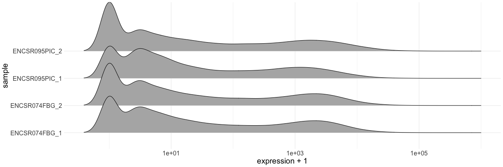

What about real data???
========================================================
class: small-code
Filter low or non-existent genes:


```r
ggplot(gather(tead2counts[rowSums(tead2counts)>4,], key = 'sample', value = 'expression'), 
       aes(y = sample, x = expression + 1)) + 
  geom_density_ridges() + scale_x_log10() +  theme_minimal() + 
  theme(text = element_text(size=20))
```

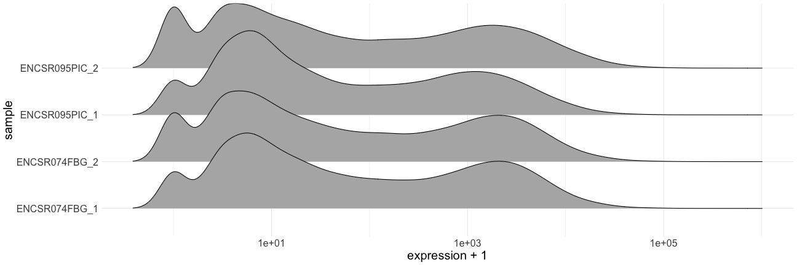

Exploration of DEA results
========================================================
class: small-code


```
    Symbol    baseMean log2FoldChange      lfcSE      stat       pvalue
1   TSPAN6    7.105750      2.5026793 1.45989949 1.7142819 8.647696e-02
2     DPM1 1256.942905      0.7960843 0.13039126 6.1053505 1.025753e-09
3    SCYL3  740.612975      0.2514511 0.15451896 1.6273157 1.036701e-01
4 C1orf112 1015.074667      0.6710649 0.13920991 4.8205257 1.431804e-06
5      FGR    4.432217      0.8548957 1.94296762 0.4399948 6.599409e-01
6      CFH 3748.942497      0.7820141 0.09937186 7.8695732 3.558533e-15
          padj
1           NA
2 1.053068e-08
3 1.854220e-01
4 8.131713e-06
5           NA
6 9.923409e-14
```

The M-A plot
========================================================
class: small-code

- M: Log Fold Change
- A: Expression Level

smaller absolute differences lead to larger LFC at the low end


```r
ggplot(maframe, aes(x = baseMean, y = log2FoldChange)) + 
  geom_point(alpha = 0.05) + xlab("A") + ylab("M") + scale_x_log10() + theme_minimal() + 
  theme(text = element_text(size=20))
```

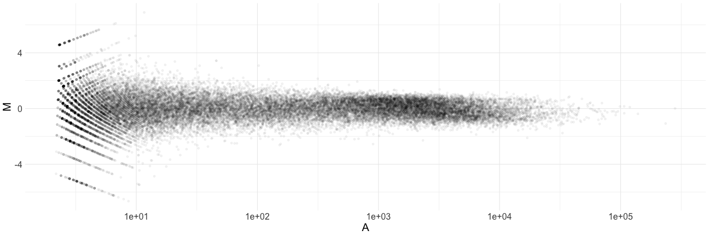

What about the DESeq2 model?
========================================================
- Uses the negative bionomial distribution

What about the DESeq2 model?
========================================================
- Uses the negative bionomial distribution
- Similar to binomial, but models 0 counts or "failures" rather than successes

What about the DESeq2 model?
========================================================
- Uses the negative bionomial distribution
- Similar idea to binomial, but models 0 counts or "failures" rather than successes
- Poisson breaks down when variance >> mean

What about the DESeq2 model?
========================================================
- Uses the negative bionomial distribution
- Similar idea to binomial, but models 0 counts or "failures" rather than successes
- Poisson breaks down when variance >> mean
- Alternative parameterization includes size or "dispersion" parameter

What about the DESeq2 model?
========================================================
- Uses the negative bionomial distribution
- Similar idea to binomial, but models 0 counts or "failures" rather than successes
- Poisson breaks down when variance >> mean
- Alternative parameterization includes size or "dispersion" parameter
- Dispersion is a property of each gene which can be fit to the data

Gene-wise Dispersion Estimates (DESeq2)
========================================================
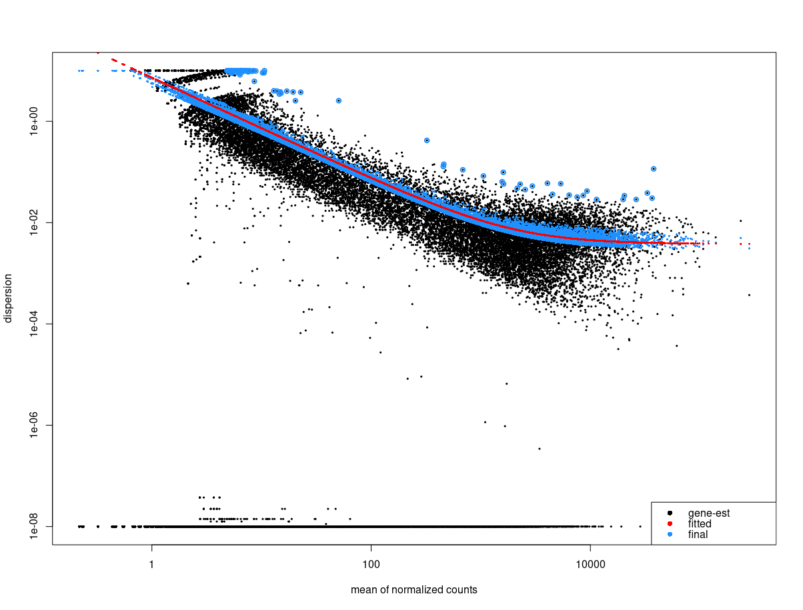


Gene-wise Dispersion Estimates (DESeq2)
========================================================
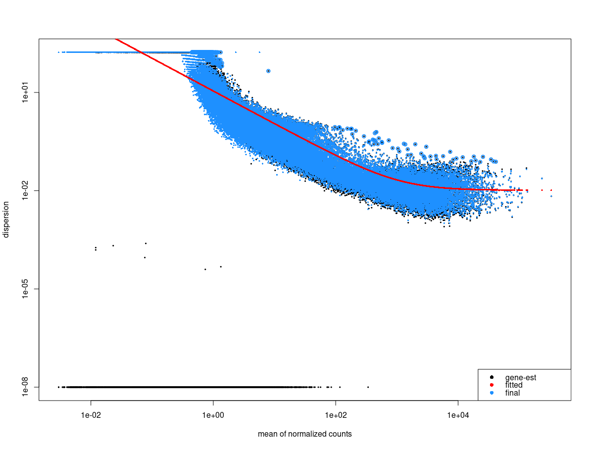

Fundamentals of Principle Components Analysis
========================================================
[Nat Biotechnol. 2008 Mar;26(3):303-4](https://www.nature.com/articles/nbt0308-303)

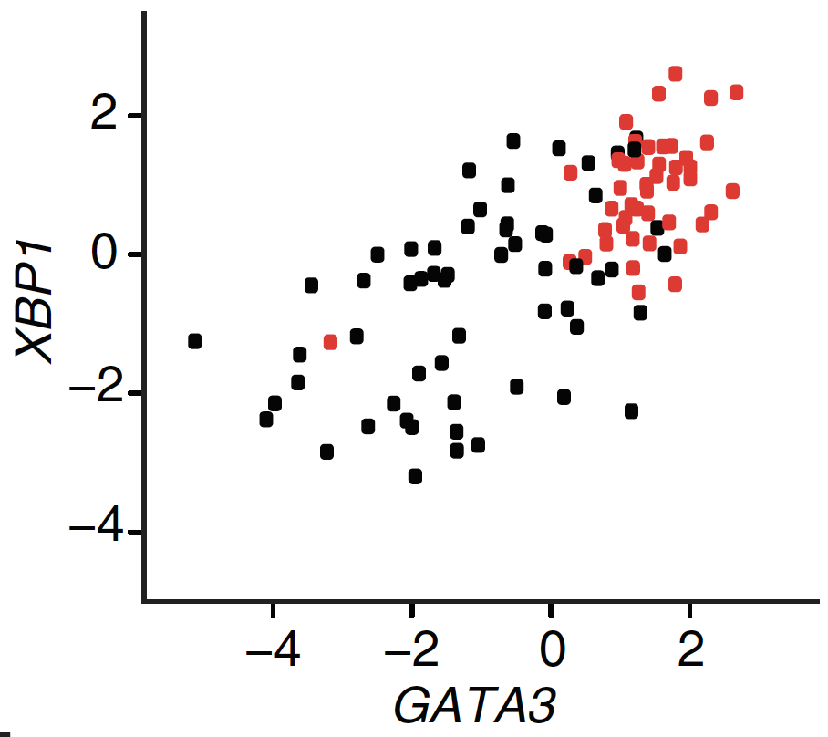

Each dot represents a breast cancer sample plotted against its expression levels for two genes.

Fundamentals of Principle Components Analysis
========================================================
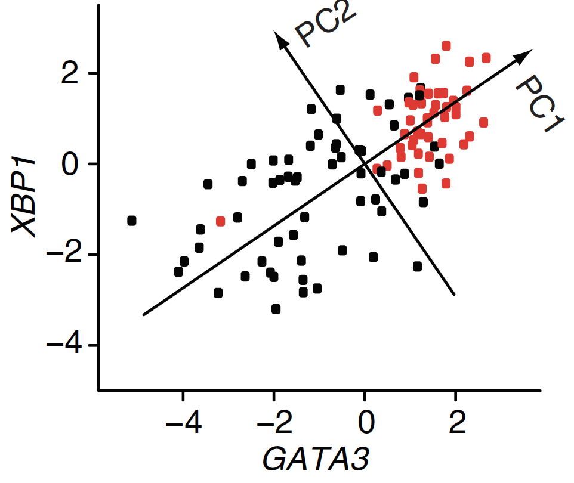

PCA identifies the two directions (PC1 and PC2) along which the data have the largest spread.

Fundamentals of Principle Components Analysis
========================================================
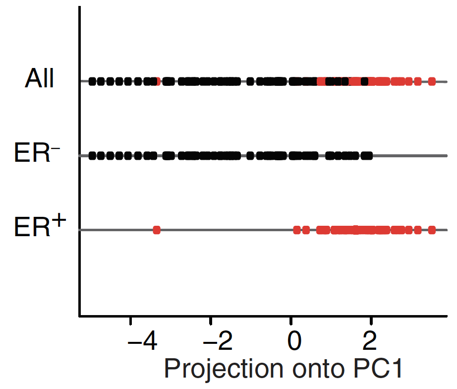

Samples plotted in one dimension using their projections onto the first principal component (PC1) for ER+, ER– and all samples separately.

Fundamentals of Principle Components Analysis
========================================================
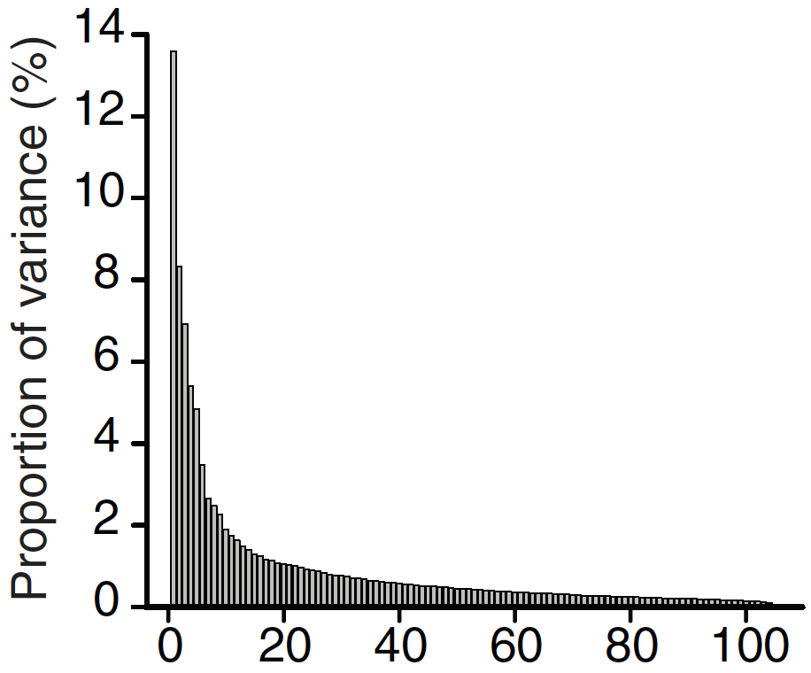

The variance of the principal components when PCA is applied to all 8,534 genes with
expression levels for all samples.

Fundamentals of Principle Components Analysis
========================================================
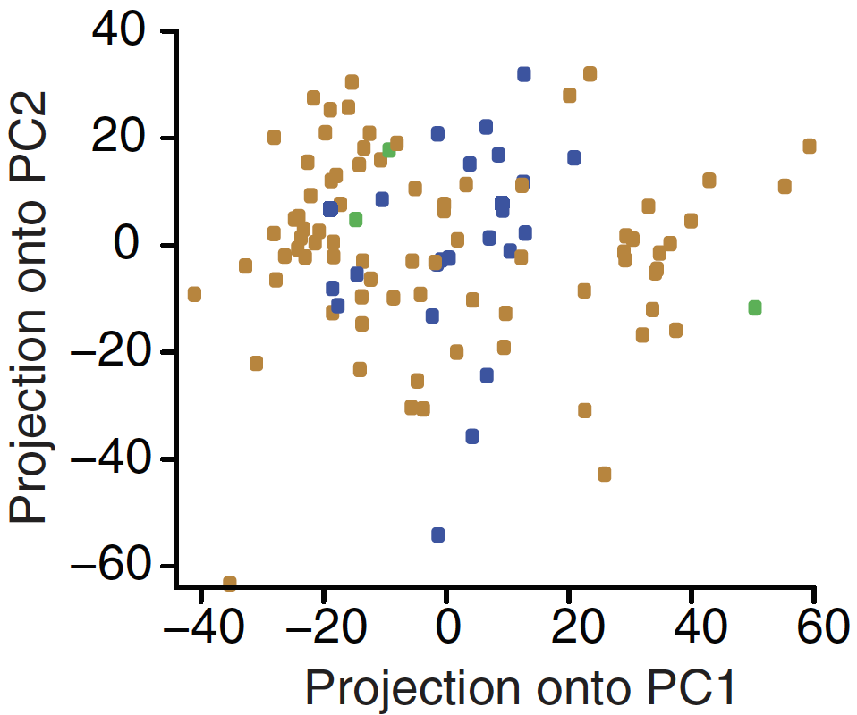


Samples colored according to ERBB2 status (blue, ERBB2+;
brown, ERBB2 – ; green, unknown

t-SNE & UMAP: reducing multidimensional analysis to 2D
========================================================

