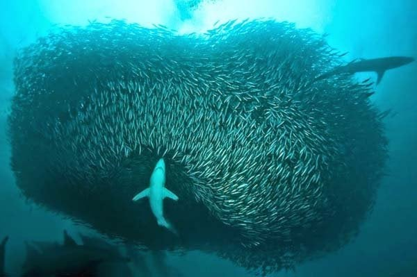
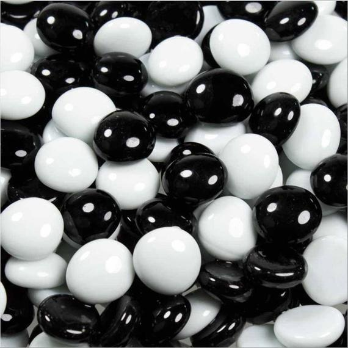

<style>
.small-code pre code {
  font-size: 1em;
}
</style>

Lecture 4 Biological enrichment calculations and GO/GSEA
========================================================
author: 
date: 05/21/2020
autosize: true
transition: fade


Goals
========================================================

- learn what qualifies as enrichment

Goals
========================================================

- learn what qualifies as enrichment
- learn various ways to calculate enrichment for different situations

Goals
========================================================

- learn what qualifies as enrichment
- learn various ways to calculate enrichment for different situations
- applications to annotations in RNA-seq data (i.e. GO)

Goals
========================================================

- learn what qualifies as enrichment
- learn various ways to calculate enrichment for different situations
- applications to annotations in RNA-seq data (i.e. GO)
- what are ontologies, and what are their limitations?

Why enrichment?
========================================================

We hear this term of art _constantly_ throughout biology, molecular biology, genomics & especially bioinformatics.


Why enrichment?
========================================================

# ENRICHMENT IS **evidence for organized activity**



What is enrichment?
========================================================

more things than expected due to random chance

What is enrichment?
========================================================

more things than expected due to random chance

- what do you expect?

What is enrichment?
========================================================

more things than expected due to random chance

- what do you expect?
- what defines randomness?

Calculating enrichment
========================================================




Calculating enrichment
========================================================

- finite number of marbles

Calculating enrichment
========================================================

- finite number of marbles
- known number of blacks & whites

Calculating enrichment
========================================================

- finite number of marbles
- known number of blacks & whites
- therefore probabilities are known

Calculating enrichment
========================================================

- finite number of marbles
- known number of blacks & whites
- therefore probabilities are known p_white, p_black

Calculating enrichment
========================================================

If we select a single marble, the probabilities change

- what distribution?

Calculating enrichment
========================================================

If we select multiple marbles, the probabilities are described by

# [Hypergeometric distribution](https://en.wikipedia.org/wiki/Hypergeometric_distribution)

Calculating enrichment
========================================================

If we select multiple marbles, the probabilities are described by

# [Hypergeometric distribution](https://en.wikipedia.org/wiki/Hypergeometric_distribution)

Hypergeo is related to binomial dist
- finite population 
- sampling without replacement

Calculating enrichment in R
========================================================
class: small-code

Function `phyper`


```r
phyper(q, m, n, k, lower.tail = TRUE, log.p = FALSE)
```

- `q` vector of quantiles representing the number of white marbles drawn without replacement from a bag which contains both black and white marbles.

- `m` the number of white marbles in the bag

- `n` the number of black marbles in the bag

- `k` the number of marbles drawn


Hypergeometric distribution
========================================================
class: small-code
(PMF = "**P**robability **M**ass **F**unction)


Hypergeometric distribution
========================================================
class: small-code
(PMF = "**P**robability **M**ass **F**unction)


```r
library("dplyr")
library("ggplot2")
library("foreach")
library("RColorBrewer")
## 
x = c(0, 1, 2, 4, 8, 11, 14, 15)
k = 1:59
pmfprobs <- foreach(i = x, .combine = 'rbind') %do% data.frame(x=rep(i, length(k)), k, p = dhyper(i, 15, 45, k))
ggplot(pmfprobs) + 
  geom_point(aes(x = k, y = p, colour = factor(x))) +
  geom_line(aes(x = k, y = p, colour = factor(x))) +
  scale_color_brewer(palette="Dark2", name = "successes") +
  ylab("probability") +
  theme_minimal() +
  theme(text = element_text(size=24)) +
  ggtitle("Probability Mass Function (m=15, n=45)")
```

Hypergeometric distribution: code
========================================================
class: small-code


```r
#                       \/       \/
#                       \/       \/
#                       \/       \/
phyper(q, m, n, k, lower.tail = FALSE, log.p = FALSE)
```


Hypergeo example
========================================================

- 100 marbles
- 20 are white
- Question: draw 10 (k), obtain 3 (q); **how likely is $\geq 3$?**


Hypergeo example
========================================================
class: small-code

- 100 marbles
- 20 are white
- Question: draw 10 (k), obtain 3 (q); **how likely is $\geq 3$?**


```r
phyper(2, 20, 80, 10, lower.tail = FALSE, log.p = FALSE)
```

```
[1] 0.3187799
```

Hypergeo example
========================================================
class: small-code

- 100 marbles
- 20 are white
- Question: draw 10 (k), obtain 3 (q); **how likely is $\geq 3$?**


Hypergeo example
========================================================
class: small-code

- 100 marbles
- 20 are white
- draw 10 (k), obtain 3 (q); **how likely is _exactly_ 3?**


```r
q = 1:10
probability = dhyper(x=q, m=20, n=80, k=10)
plot(q, probability, xlab = "probability density", pch=16)
lines(q, probability)
abline(h = 0.05, lty = 2, col = 'red')
abline(v = 3, col = 'blue')
```

Hypergeo example
========================================================
class: small-code

- 100 marbles
- 20 are white
- draw 10 (k), obtain 3 (q); **how likely is _exactly_ 3?**


Hypergeometric distribution 1-tailed
========================================================

# [Fisher's exact test](https://en.wikipedia.org/wiki/Fisher%27s_exact_test)

What about general enrichment problems? 
========================================================
- large populations >> k, $p$=very small
- background available

What about general enrichment problems? 
========================================================
- use math to estimate uncertainty
- aside: if probabilities known: use $\chi ^2$ test!

What about general enrichment problems? 
========================================================
- use math to estimate uncertainty
- aside: if probabilities known: use $\chi ^2$ test!
- true probability not known: Bayes to the rescue

What about general enrichment problems? 
========================================================
suppose we have 2 sets of observations:

- one is **control** condition
- one is **alternative** condition
- each observation is a "draw" as in hypergeo, but now

What about general enrichment problems? 
========================================================
suppose we have 2 sets of observations:

- one is **control** condition
- one is **alternative** condition
- each observation is a "draw" as in hypergeo, but now

### sample with replacement
### population unknown in both cases

General Enrichment Calculation
========================================================
class: small-code

What is the probability of finding a read in a given gene (random draw), given the data


```r
plot(density(rbeta(1e5, 234, 4e7)), xlim=c(0,0.0001))
```


General Enrichment Calculation
========================================================
class: small-code

Splicing: splice forms A and B 


General Enrichment Calculation
========================================================
class: small-code

Splicing: splice forms A and B 

Controls: A:B = 48:186


```r
# probability of observing form A in controls
plot(density(rbeta(1e5, 48, 186)), xlim=c(0,1), main="splicing example")
```


General Enrichment Calculation
========================================================
class: small-code

New Condition: observe 24 A, 47 B


```r
# probability of observing form A in controls
plot(density(rbeta(1e5, 48, 186)), xlim=c(0,1), main="splicing example")
lines(density(rbeta(1e5, 24, 47)))
```


General Enrichment Calculation
========================================================
class: small-code

New Condition: observe 24 A, 47 B


```r
# probability of observing form A in controls
plot(density(rbeta(1e5, 48, 186)), xlim=c(0,1), main="splicing example")
lines(density(rbeta(1e5, 24, 47)))
lines(density(rbeta(1e5, 24, 47)-rbeta(1e5, 48, 186)), lty=2, col='red')
```


General Enrichment Calculation
========================================================
class: small-code

**"Null"** hypothesis test: rejection!


```r
nsamples <- 1e6
treatment <- rbeta(nsamples, 24, 47)
control <- rbeta(nsamples, 48, 186)
p_value <- sum(treatment - control <= 0) / nsamples
print(p_value)
```

```
[1] 0.012785
```


General Enrichment Calculation: Applications
========================================================
class: small-code

- splicing

General Enrichment Calculation: Applications
========================================================

- splicing
- enrichment of SNPs in epigenomics data

General Enrichment Calculation: Applications
========================================================

- splicing
- enrichment of SNPs in epigenomics data
- allele specific expression (ASE)

General Enrichment Calculation: Applications
========================================================

### Any problem involving count data where the underlying probability is not known but a suitable "background" condition is available for comparison

Enrichment in ranked lists
========================================================

</img>

Online methods
========================================================

- [GOrilla](http://cbl-gorilla.cs.technion.ac.il/)
- [**G**ene **S**et **E**nrichment **A**nalysis (GSEA)](https://www.gsea-msigdb.org/gsea/index.jsp)

How GSEA Works
========================================================

shamelessly stolen from: [Hector Corrada Bravo](http://users.umiacs.umd.edu/~hcorrada/CMSC858B/lectures/lect14/GeneSets.pdf)

</img>

How GSEA Works
========================================================

</img>

How GSEA Works
========================================================

</img>

How GSEA Works
========================================================

</img>

How GSEA Works
========================================================

</img>

Ontologies
========================================================

<i><b>"In computer science and information science, an ontology encompasses a representation, formal naming and definition of the categories, properties and relations between the concepts, data and entities that substantiate one, many or all domains of discourse. More simply, an ontology is a way of showing the properties of a subject area and how they are related, by defining a set of concepts and categories that represent the subject."</i></b>

(from Wikipedia)

Ontologies
========================================================

[GeneOntology.org](http://geneontology.org/docs/ontology-documentation/)

Gene Ontology is a curated graph of terms
========================================================

- `Molecular Function` (_e.g._ "adenylate cyclase activity")
- `Cellular component` (_e.g._ "ribosome")
- `Biological Process` (_e.g._ "DNA repair")

Other Useful Ontologies
========================================================

- [Kegg Pathways](https://www.genome.jp/kegg/pathway.html)
- [Reactome](https://reactome.org/)

Other Useful Ontologies
========================================================

[MSigDB](https://www.gsea-msigdb.org/gsea/msigdb/collection_details.jsp)

- Hallmark genesets
- Canonical pathways
- Regulatory Target genesets
- disease genesets
- many cancer sets
- Gene Ontology

Finally: A word about the construction and limitations of all ontologies
========================================================

</img>

Finally: A word about the construction and limitations of all ontologies
========================================================

</img>

- this is how genes relate to multiple terms

Finally: A word about the construction and limitations of all ontologies
========================================================

</img>

- this is how genes relate to multiple terms
- the usefulness of GO terms varies _greatly_ throughout the graph

Example of bias in ontology enrichment analysis
========================================================

</img>
