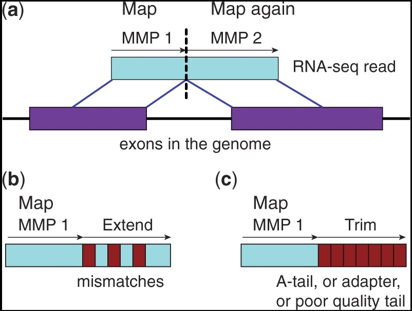
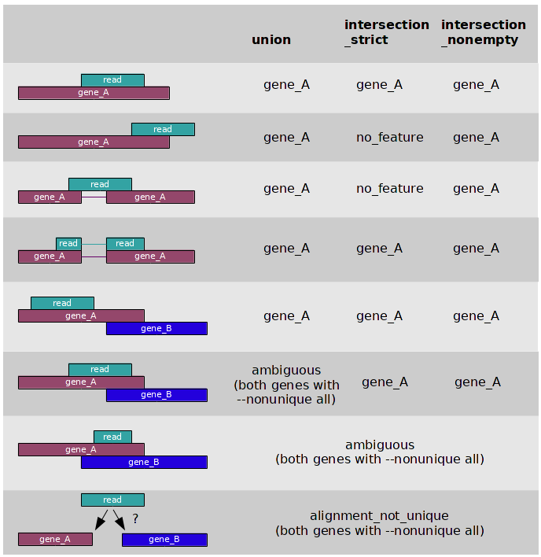
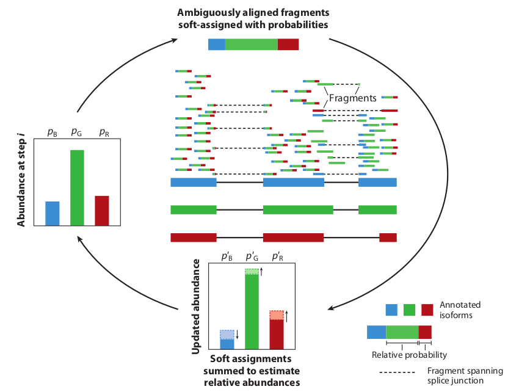

Lecture 6: Quality Control & Alignment Basics
========================================================
author: Simon Coetzee
date: 04/15/2021
width: 1440
height: 900
transition: fade

Goals
========================================================

- Understanding computational context of RNA-Seq

Goals
========================================================

- Understanding computational context of RNA-Seq

- Learning to judge data for quality metrics of RNA-Seq

Common RNA-Seq Computational Processing
========================================================

- Alignment
  - _Tools Like:_
  - STAR - [github](https://github.com/alexdobin/STAR)
  - HISAT2 - [link](http://daehwankimlab.github.io/hisat2/)
  - Bowtie 2 - [link](http://bowtie-bio.sourceforge.net/bowtie2/index.shtml)

Common RNA-Seq Computational Processing
========================================================

- Alignment
- Mapping
  - _Tools Like:_
  - Salmon - [documentation](https://salmon.readthedocs.io/en/latest/index.html)
  - Kallisto - [documentation](https://pachterlab.github.io/kallisto/starting)

Common RNA-Seq Computational Processing
========================================================

- Alignment
- Mapping
- Counting
  - _Tools Like:_
  - featureCounts - [documentation](http://bioinf.wehi.edu.au/featureCounts/)
  - HTSeq - [documentation](https://htseq.readthedocs.io/en/master/)
  - RSEM - [documentation](https://deweylab.github.io/RSEM/README.html)

Alignment
========================================================

- Requires a genome `.fasta` file & preferably a `.gtf` file containing a comprehensive set of genes
  - These produce an index

- Requires reads in the form of `.fastq`

- Outputs a `.bam`/`.sam` file indicating where reads are mapped in the genome.

- To be followed up likely by a quantification step.

Alignment
========================================================

- Input can be single end or paired end reads.

Alignment
========================================================

Alignment
========================================================

- Alignment to the genome
  - STAR does this, also HISAT2 and Bowtie2

Alignment
========================================================

- Alignment to the genome.
- Alignment to the transcriptome.
  - Rare in the context of true alignment.
  - May be valuable where a quality genome does not exist for your organism.

Alignment
========================================================

- Alignment to the genome.
- Alignment to the transcriptome.

Counting
========================================================

Counts represent the number of reads produced by the RNA-Seq experiement that can be assigned to a genomic feature.

They are the measurement that we can use to estimate differential expression.

They can be converted to many different abundance measurements.

Counting
========================================================

*Counts to abundance:*

A lot more detail *[here](http://robpatro.com/blog/?p=235)*

**CPM = Counts Per Million**

`CPM = (count * 10e6) / total_reads`

**RPKM = Reads Per Kilobase per Million mapped reads** or **FPKM = Fragments Per Kilobase per Million mapped reads**

`RPKM (or FPKM) = (count * 1e3 * 1e6) / (total_reads * gene_length_in_bp)`

**TPM = Transcript Per Million**

`TPM = A * (1 / sum(A)) * 1e6`

`A = count * 1e3 / gene_length_in_bp`

Counting
========================================================

Considerations:

Counting
========================================================

Work Around:

Mapping
========================================================

- Alternative to alignment + counting.
- Sometimes called lightweight alignment.

Mapping
========================================================

- Alternative to alignment + counting.
- Useful for quantifying gene expression of known genes and isoforms.

Mapping
========================================================

- Alternative to alignment
- Useful for quantifying gene expression of known genes and isoforms.
- Fast and computationally cheap.- Sometimes called lightweight alignment.
- Direct to transcriptome - only as good as your gene models.

Mapping
========================================================

Tiny cluster for doing mapping

~ 15 million reads on one core in 11 minutes

Mapping
========================================================

Get read assignment to genes/transcripts for free

There is no seperate quantification step

Mapping
========================================================

Mapping
========================================================

The main tools are salmon and kallisto

Mapping
========================================================

- Requires a transcriptome `.fasta` file & preferably a `.gtf` file containing a comprehensive set of genes
  - These produce an index

- Requires reads in the form of `.fastq`

- Outputs a table with Transcript IDs, Counts, Transcript Lengths, and TPM values

Mapping
========================================================

- Outputs a table with Transcript IDs, Counts, Transcript Lengths, and TPM values

| Name  | Length  | EffectiveLength  |  TPM | NumReads  |
|:-:|:-:|:-:|:-:|:-:|
| ENST00000456328.2  | 1657  | 1869.277  | 0.000000  |  0.000 |
| ENST00000488147.1  | 1351  | 1646.916  | 7.718260  |  255.879 |

The effective length is akin to the regular length of each transcript type, except that it accounts for the fact that not every transcript in the population can produce a fragment of every length starting at every position.  Actually, a transcript has an effective length with respect to each possible fragment that maps to it

Quality Control
========================================================

Should be done both before and after alignment

AKA on the FASTQ files directly and on the resulting BAMS

Quality Control
========================================================

A lot of quality control becomes clearer in the context of other experiments.

[MultiQC](https://multiqc.info/docs/) facilitates this process with plugins to colate [92 different QC tools](https://multiqc.info/#supported-tools):

Quality Control - FASTQ
========================================================

[*FastQC*](https://www.bioinformatics.babraham.ac.uk/projects/fastqc/)

Quality Control - FASTQ
========================================================

[*FastQ Screen*](https://www.bioinformatics.babraham.ac.uk/projects/fastq_screen/)

Quality Control - BAMs
========================================================

[Preseq](http://smithlabresearch.org/software/preseq/) | 
[featureCounts](http://bioinf.wehi.edu.au/featureCounts/) |
[Picard](https://broadinstitute.github.io/picard/picard-metric-definitions.html#RnaSeqMetrics) |
[STAR](https://github.com/alexdobin/STAR)

Quality Control - BAMs
========================================================

What can we look for specifically?
- Low read mapping rate
- 3’/5’ end bias
- rRNA and mtRNA
- Duplicate Reads / Complexity

Low read mapping rate
========================================================
Mapping rate guidelines: 
  * >70% to the genome 
  * >60% to the transcriptome

Poor quality reads, contaminating sequences

Low read mapping rate
========================================================
Mapping rate guidelines: 
  * >70% to the genome 
  * >60% to the transcriptome

Poor quality reads, contaminating sequences

Inappropriate alignment parameters, or reference gneome/transcriptome

Low read mapping rate
========================================================
Mapping rate guidelines: 
  * >70% to the genome 
  * >60% to the transcriptome

Poor quality reads, contaminating sequences

Inappropriate alignment parameters, or reference gneome/transcriptome

Low quality reference genome/transcriptome (less relevant for mouse/human)

3’/5’ end bias
========================================================
Can’t really produce a perfectly uniform coverage across entire transcripts.

Introduced by library construction, especially if starting RNA is degraded.

**_3’ bias_** common when subjected to polyA enrichment.

**_5’ bias_** common when subjected to rRNA depletion.

Low exonic mapping rate
========================================================
low (<50%) of reads aligning to exons.

high (>30%) of reads in introns or intergenic regions.

high (>2%) of reads in rRNA

Low exonic mapping rate
========================================================
low (<50%) of reads aligning to exons.

high (>30%) of reads in introns or intergenic regions.

*genomic DNA contamination, pre-mRNA*

high (>2%) of reads in rRNA.

*unsuccessful ribo-depletion*

rRNA and mtRNA
========================================================
The goal of most RNA-seq studies is to interrogate functional mRNA. However, structure RNAs such as Ribosomal RNA (rRNA), (or tRNAs) can constitute > 50% of total RNA in the cell, soaking up reads and lowering effective depth. These should be depleted in library preparation.

Duplicate Reads
========================================================
Two or more reads are assumed to be derived from the same nucleotide fragment and not representing independent transcriptome information from the sample.
Typically, for paired-end read data (single-end data is also handled) these algorithms find the 5p coordinates and mapping orientations of each read pair while taking into account all clipping that has taking place as well as any gaps or jumps in the alignment. All read pairs sharing identical 5p coordinates and orientations are marked as duplicates except the "best" pair.

There is a concern that duplicates may correspond to biased PCR amplification of particular fragments, however, for highly expressed or short genes, duplicates are expected even if there is no amplification bias. Removing them will reduce the dynamic range of expression estimates. Generally duplicates should therefore not be removed in RNA-seq analysis

Library Complexity
========================================================
Preseq is a tool to help you design and optimize sequencing experiments by using population sampling models to infer properties of the population or the behavior under deeper sampling based upon a small initial sequencing experiment. 

The estimates can then be used to examine the utility of further sequencing, optimize the sequencing depth, or to screen multiple libraries to avoid low complexity samples.

Library Complexity
========================================================
The estimates can then be used to examine the utility of further sequencing, optimize the sequencing depth, or to screen multiple libraries to avoid low complexity samples.

Library Complexity
========================================================
The estimates can then be used to examine the utility of further sequencing, optimize the sequencing depth, or to screen multiple libraries to avoid low complexity samples.

Homework
========================================================
Using the provided pre- and post- alignment metrics, evaluate the sequencing files corresponding to your transcription factor. For each metric, see if you can find a sample that looks as good or better, and another that is worse. Describe how you evaluated "better" or "worse". Given only the quality of the data for your transcription factor, would you request a repeat of the experiment if it was in your power to do so?
